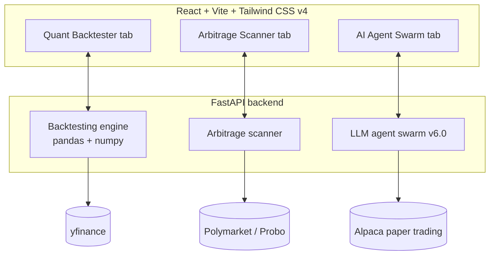

# AlgoBAcktestingBot
The FinTech Anchor (v7.0) is an institutional-grade quantitative trading platform featuring a multi-model backtesting suite (SMA, RSI, MACD, Linear Regression), an autonomous LLM agent swarm for prediction market analysis, and a Polymarket x Probo cross-platform arbitrage terminal with live Alpaca paper execution.
<div align="center">

 
*A hybrid workspace bridging traditional asset backtesting and decentralized event-driven forecasting, powered by autonomous multi-model AI reasoning agents.*
 


 


 
</div>
---
 
## 📖 Table of contents
 
- [Overview](#-overview)
- [Demo](#-demo)
- [Features](#-features)
- [Architecture](#-architecture)
- [Tech stack](#-tech-stack)
- [Getting started](#-getting-started)
- [Project structure](#-project-structure)
- [Roadmap](#-roadmap)
- [Disclaimer](#-disclaimer)
- [Contributing](#-contributing)
- [License](#-license)
---
 
## ✨ Overview
 
**The FinTech Anchor** started as a simple moving-average script and has grown into a full quantitative research terminal. It brings together three things that are usually built as separate tools:
 
- **Backtesting traditional assets** — stocks, crypto, and penny stocks, tested against multiple strategy models over 5 years of historical data.
- **Prediction market intelligence** — scanning cross-platform pricing spreads on event-driven, binary-outcome markets.
- **Autonomous AI reasoning** — a multi-model LLM swarm that debates theses, estimates statistical edge, and sizes positions using the Kelly criterion.
Everything runs through a single FastAPI backend and renders in a dark-mode, data-dense React terminal built for fast iteration.
 
## 🎬 Demo
 
> 📸 *Add a screenshot or GIF of the Command Deck here — a working terminal view is the single best thing this README can show.*
 
<!--  -->
 
## 🚀 Features
 
### 📊 Quant backtesting engine
- Multi-year (5-year) historical backtests via `yfinance`, for any global ticker, crypto pair, or penny stock
- Four strategy models: Moving Average Crossover (20/50 SMA), RSI Mean Reversion, MACD Momentum, and Linear Regression Trend Following
- Automated risk analytics — Sharpe ratio, max drawdown, benchmark vs. strategy returns, and $100-initial-capital growth curves rendered with Recharts
- Smart ticker autocomplete with fallback lookups for less common symbols
### ⚖️ Cross-platform arbitrage scanner
- Scans binary contract spreads across prediction market platforms (e.g. Polymarket's CLOB and Probo's OMS)
- Surfaces cross-platform order book discrepancies as they appear
### 🤖 Agentic LLM swarm (v6.0)
- Multi-model reasoning architecture that evaluates prediction market theses
- Agents debate probabilities and calculate expected statistical edge
- Suggests position sizing using the Kelly criterion
### ⚡ Alpaca paper trading
- Routes automated buy/sell decisions to Alpaca's sandbox environment
- Fully virtual — no real capital at risk (see [Disclaimer](#-disclaimer))
## 🏗️ Architecture
 

 
The three modules currently operate as independent tabs sharing one backend. The next major milestone unifies them — see [Roadmap](#-roadmap).
 
## 🛠️ Tech stack
 
| Layer | Technology |
|---|---|
| Backend | Python, FastAPI, Uvicorn |
| Data & compute | Pandas, NumPy, Scikit-learn |
| Market data | `yfinance`, `ib_async` |
| Execution | Alpaca Trade API |
| Frontend | React, Vite, Tailwind CSS v4 |
| Charts | Recharts |
| Icons | Lucide |
 
## 🏁 Getting started
 
### Prerequisites
- Python 3.11+
- Node.js 18+ and npm
- A free [Alpaca](https://alpaca.markets/) paper trading account (API key + secret)
- At least one LLM provider API key for the agent swarm (OpenAI, Anthropic, or a local Ollama endpoint)
### 1. Clone the repository
```bash
git clone https://github.com/PrKsh-3012/AlgoBAcktestingBot.git
cd AlgoBAcktestingBot
```
 
### 2. Backend setup
```bash
cd backend
python -m venv venv
source venv/bin/activate      # Windows: venv\Scripts\activate
pip install -r requirements.txt
cp .env.example .env          # then fill in the keys below
uvicorn app.main:app --reload --port 8000
```
 
### 3. Frontend setup
```bash
cd frontend
npm install
npm run dev
```
 
The app runs at `http://localhost:5173`, with interactive API docs (Swagger UI) at `http://localhost:8000/docs`.
 
### Environment variables
 
| Variable | Description | Required |
|---|---|---|
| `ALPACA_API_KEY` | Alpaca paper trading API key | Yes |
| `ALPACA_SECRET_KEY` | Alpaca paper trading secret key | Yes |
| `ALPACA_BASE_URL` | `https://paper-api.alpaca.markets` | Yes |
| `OPENAI_API_KEY` / `ANTHROPIC_API_KEY` | LLM provider key(s) for the agent swarm | At least one |
| `POLYMARKET_API_URL` / `PROBO_API_URL` | Prediction market data endpoints | Optional |
 
## 📁 Project structure
 
<details>
<summary>Click to expand</summary>
```
AlgoBAcktestingBot/
├── backend/
│   ├── app/
│   │   ├── main.py
│   │   ├── routers/
│   │   │   ├── backtest.py
│   │   │   ├── arbitrage.py
│   │   │   ├── swarm.py
│   │   │   └── execution.py
│   │   ├── services/
│   │   │   ├── quant_models.py
│   │   │   ├── risk_metrics.py
│   │   │   ├── alpaca_client.py
│   │   │   └── llm_swarm.py
│   │   └── core/
│   ├── requirements.txt
│   └── .env.example
├── frontend/
│   ├── src/
│   │   ├── components/
│   │   ├── pages/
│   │   │   ├── Backtester.jsx
│   │   │   ├── ArbitrageScanner.jsx
│   │   │   └── AgentSwarm.jsx
│   │   ├── hooks/
│   │   └── App.jsx
│   ├── package.json
│   └── vite.config.js
└── README.md
```
 
*(Adjust to match your actual repo layout.)*
 
</details>
## 🗺️ Roadmap
 
- [x] Multi-model quant backtesting engine
- [x] Cross-platform arbitrage scanner (concept)
- [x] LLM agent swarm v6.0 (simulated consensus)
- [x] Alpaca paper trading integration
- [ ] Live WebSocket order-book streaming from Polymarket / Probo
- [ ] Real LLM API integration — swap the mock consensus engine for live OpenAI / Anthropic / Ollama calls
- [ ] Automated risk guardrails — stop-loss and take-profit triggers in the agentic execution loop
- [ ] **v8.0 — Signal fusion engine ("CIO agent")**: a new reasoning layer that ingests the backtester's strategy signals *and* the arbitrage scanner's spread signals, cross-references them against live news/macro context, and outputs a single ranked, explainable, Kelly-sized opportunity feed across both asset classes — replacing three disconnected tabs with one coherent intelligence layer
## ⚠️ Disclaimer
 
This project is for **educational and research purposes only** and does not constitute financial advice. All trading currently routes through Alpaca's **paper trading (sandbox)** environment — no real capital is at risk. Strategy performance shown in backtests does not guarantee future results. Use at your own risk if you extend this to live trading.
 
## 🤝 Contributing
 
This is currently a solo portfolio project, but issues and pull requests are welcome — whether that's a bug report, a new strategy model, or a suggestion for the v8.0 fusion engine.
 

---
 
<div align="center">
Built by [Prakash](https://github.com/PrKsh-3012)
 
</div>
